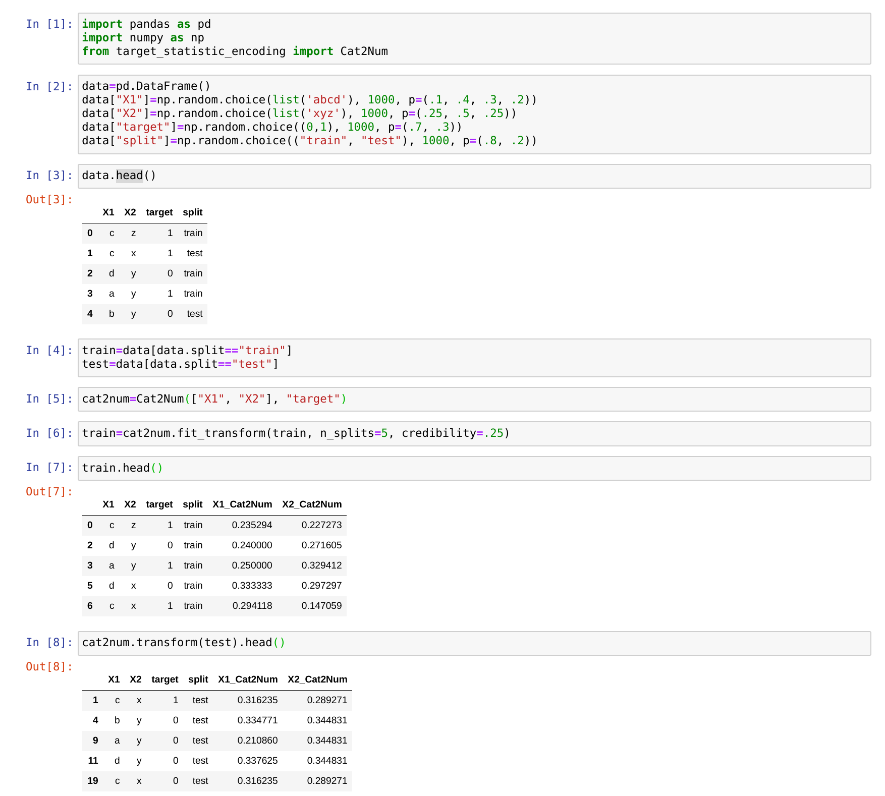

# target statistic encoding

<div align="center">


</div>

---


# What?

There are many means to convert categorical features to numeric ones from one-hot to embeddings. Then there are target statistic methods. These methods take statistics based on the target feature.

# Why?

Even within this simple technique there is variation in implementations. Some implement a time-mimicking approach such as Catboost to gain robustness over target leakage. However, one issue with this approach is that while it introduces some variation to the encoding, for a some samples the statistic is possibly excessively biased. This small package takes a different approach for this reason. Instead, it uses stratified folds of the training set and aggregates target statistics on each fold independently.

# How?

This is just a simple utility library that performs the following sample operation:
[See this example notebook](examples/example.ipynb)


# API

## Instantiate
```python
Init signature: Cat2Num(cat_vars: List[str], target_var: str)
Args:
    cat_vars (List[str]): a list of strings representing the categorical features to be encoded
    target_var (str): string of the name of the target feature in `data`
```

## fit

### prefer`.fit_transform` on your training set
***Note: running `.fit` followed by `.transform` on your training set is not equivalent to simply running `.fit_transform`. There wil be no differentiation amongst category statistics as they will all be mapped to the mean.***

```python
cat2num.fit_transform(
    data: pandas.core.frame.DataFrame,
    split: str = None,
    n_splits: int = 5,
    credibility: Union[float, int] = 0,
    drop: bool = False,
    suffix: str = '_Cat2Num',
    inplace: bool = False,
)

Args:
    data (pd.DataFrame): pandas dataframe with categorical features to convert to numeric target statistic
    split (str): name of a column to use in the data for folding the data.
        - if this is use then n_splits is ignored
    n_splits (int): number of splits to use for target statistic
    credibility (float or int): 
        - if float must be in [0, 1] as % of fitting data considered credible to fit statistic to
        - if int must be >=0 as number of records in fitting data level must exist within to be credible
        - levels not above this threshold will be given the overall target mean
    drop (bool): drop the original columns
    suffix (str): a string to append to the end of an encoded column, default `'_Cat2Num'`
    inplace (bool): whether the transformation should be done inplace or return the transformed data, default `False`
    
Returns:
    the passed dataframe with encoded columns added if inplace is `False` else `None`
```

```python
cat2num.fit(
    data: pandas.core.frame.DataFrame,
    credibility: Union[float, int] = 0,
)

Args:
    data (pd.DataFrame): pandas dataframe with categorical features to fit numeric target statistic from
    credibility (float or int): 
        - if float must be in [0, 1] as % of fitting data considered credible to fit statistic to
        - if int must be >=0 as number of records in fitting data level must exist within to be credible
        - levels not above this threshold will be given the overall target mean
        
Returns:
    fit Cat2Num instance
```

### use `transform` on your __non-training__ set

```python
cat2num.transform(
    data: pandas.core.frame.DataFrame,
    drop: bool = False,
    suffix: str = '_Cat2Num',
    inplace: bool = False,
)

Args:
    data (pd.DataFrame): pandas dataframe with categorical features to convert to numeric target statistic
    drop (bool): drop the original columns
    suffix (str): a string to append to the end of an encoded column, default `'_Cat2Num'`
    inplace (bool): whether the transformation should be done inplace or return the transformed data, default `False`
    
Returns:
    the passed dataframe with encoded columns added if inplace is `False` else `None`
```
